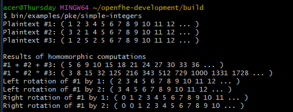

# Homomorphic Encryption Example with OpenFHE

This project demonstrates how to use the **OpenFHE** cryptographic library to perform **homomorphic encryption**

## 🔐 What is Homomorphic Encryption?

Homomorphic encryption allows computations to be performed directly on encrypted data without decrypting it first. The result of such computations, once decrypted, matches the result of the operations as if they were performed on the original plaintext.

## Sample Execution of Homomorphic Encryption using BFV (integer arithmetic operation)

References:
https://openfhe.org/
https://github.com/openfheorg/openfhe-development
